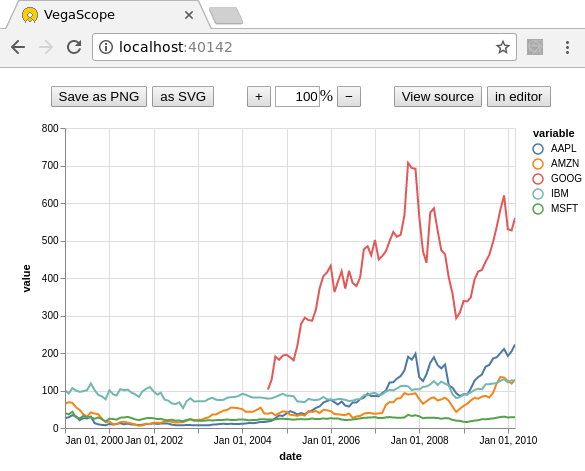

VegaScope
=========

VegaScope is a minimal viewer of [Vega](https://vega.github.io/vega/) and [Vega-Lite](https://vega.github.io/vega-lite/) graphics from Python. The Python process generating the graphics does not need to be on the same machine as the web browser viewing them.

VegaScope has zero dependencies and can be installed as a single file. It can be used as a Python library or as a shell command, watching a file or stdin.

To install, simply

```bash
pip install vegascope
```

(with `--user` if not superuser) or copy the single [vegascope.py](https://raw.githubusercontent.com/diana-hep/vegascope/master/vegascope.py) file to the desired location.

Example
-------

Suppose that we have a process that generates Vega graphics, such as [PdVega](https://jakevdp.github.io/pdvega/) (example requires pip packages `pdvega` and `vega_datasets`):

```python
>>> from vega_datasets import data
>>> import pdvega
>>> stocks = data.stocks(pivoted=True)
>>> stocks.vgplot.line().spec
```
```
{'selection': {'grid': {'bind': 'scales', 'type': 'interval'}}, 'encoding': {'y': {'field': 'value', 'ty
pe': 'quantitative'}, 'x': {'field': 'date', 'type': 'temporal'}, 'color': {'field': 'variable', 'type':
 'nominal'}}, 'height': 300, 'width': 450, '$schema': 'https://vega.github.io/schema/vega-lite/v2.json',
 'mark': 'line', 'data': {'values': [{'date': '2000-01-01', 'variable': 'AAPL', 'value': 25.94}, {'date'
...
```

This `stocks.vgplot.line().spec` is a JSON object representing a timeseries of stock prices. It is too complicated to read manually.

Import `vegascope` and create a `LocalCanvas`. It opens a tab in your web browser (**hint:** check other desktops or create a browser window in the current desktop first!) for drawing Vega graphics.

Every time the canvas is called as a function on a Vega graphic, the web page will be updated with the latest plot. There is no need to refresh your browser.

```python
>>> import vegascope
>>> canvas = vegascope.LocalCanvas()
Created new window in existing browser session.
127.0.0.1 connected

>>> canvas.how()
Point web browser at: http://localhost:40142

>>> canvas(stocks.vgplot.line().spec)
```



PdVega was only used as an example; the graphic could have come from anywhere. It could be a URL string:

```python
>>> canvas("https://vega.github.io/vega/examples/stacked-bar-chart.vg.json")
```

Or a JSON string:

```python
>>> graphic = """{
...   "$schema": "https://vega.github.io/schema/vega-lite/v2.json",
...   "description": "A simple bar chart with embedded data.",
...   "data": {
...     "values": [
...       {"a": "A","b": 28}, {"a": "B","b": 55}, {"a": "C","b": 43},
...       {"a": "D","b": 91}, {"a": "E","b": 81}, {"a": "F","b": 53},
...       {"a": "G","b": 19}, {"a": "H","b": 87}, {"a": "I","b": 52}
...     ]
...   },
...   "mark": "bar",
...   "encoding": {
...     "x": {"field": "a", "type": "ordinal"},
...     "y": {"field": "b", "type": "quantitative"}
...   }
... }"""
>>> canvas(graphic)
```

Or a JSON object as nested Python dicts. It supports the Vega 3 and Vega-Lite 2 specifications.

Interactive features
--------------------

In addition to any interactivity the Vega graphic may have on its own, VegaScope has five interactive features:

   - **Save as PNG:** create a PNG image in your downloads folder (file name is the current title + `.png`).
   - **Save as SVG:** create a SVG image in your downloads folder (ending in `.svg`). SVG files can be edited as vector graphics (you can move the data points around, add annotations) and converted losslessly to sharp PDFs. My favorite tool for editing SVG and converting to PDF is [Inkscape](https://inkscape.org/).
   - **Zoom buttons/box:** scale the graphic on the web page. Does not affect saved file size.
   - **View source:** to see the raw JSON.
   - **View in editor:** to edit and view the graphic in the official [Vega editor](https://vega.github.io/editor). This editor gives you a lot of insight into how Vega declarations translate into graphics, but it's not optimal for rapid-fire plotting.

Saving images from a script
---------------------------

You may want to save images programmatically (in a loop, for instance), so the VegaScope canvas has methods for invoking this from the server:

```python
>>> canvas.png(graphic, title="filename")   # saves filename.png
>>> canvas.svg(graphic, title="filename")   # saves filename.svg
```

However, your web browser will probably interpret this as a pop-up. You usually don't want web servers to remotely write files to your disk! In most web browsers, an indicator appears in the location bar the first time you try to write a file programmatically; select it and allow pop-ups for this server.

**Hint:** your web browser will remember the setting if you always use the same port number:

```python
>>> canvas = vegascope.LocalCanvas(port=12345)
```

Remote viewing
--------------

All of the examples above used `vegascope.LocalCanvas`. To make the web server visible to the world, create a `vegascope.Canvas`.

```python
>>> canvas = vegascope.Canvas()
Point web browser at: http://8.8.8.8:50060
```

where `8.8.8.8` is the real IP address of the machine running VegaScope. Everything proceeds as before except that the web browser is no longer restricted to the same machine as the server.

However, the connection may be blocked at any step between the server and the client. Most system administrators block all ports except a list of justified exceptions; you may need to ask for a port to be opened and explicitly pass that port.

```python
>>> canvas = vegascope.Canvas(port=12345)
Point web browser at: http://8.8.8.8:12345
```

Even beyond port blocking, some administrators may block the HTTP protocol, since web servers can be used for less benign activities than plotting. They may cite a security risk in projecting your data to anyone with the address (though you can monitor who's watching with `canvas.connections`). It depends on the sensitivity of your data.

If an unrestricted web server is not an option for you, but ssh is (after all, how are you connecting to the machine's terminal?), consider `vegascope.TunnelCanvas`.

```python
>>> canvas = vegascope.TunnelCanvas()
Type into terminal:   ssh -L 43213:localhost:43213 username@8.8.8.8
Point web browser at: http://localhost:43213
```

The TunnelCanvas is only available locally, but you can extend the meaning of "local" through an ssh tunnel. Assuming that you're already connected to the remote machine through one ssh terminal, open another terminal and paste the new ssh command into it. As long as that second terminal is open, your local web browser will see `http://localhost:43213` as the remote one.

Whereas `vegascope.Canvas` is world-readable, `vegascope.TunnelCanvas` is as safe as ssh. Choose the option that best fits your security constraints.

As a shell command
------------------

If it's more convenient to use VegaScope as a separate process, it can run as a shell command, watching a file for changes or stdin. All of the options are available as command line switches:

```
usage: vegascope.py [-h] [-w WAIT] [-t {Canvas,LocalCanvas,TunnelCanvas}]
                    [-T TITLE] [-b HOST] [-p PORT] [-q] [-Q]
                    [FILE]

VegaScope can be used within Python (import vegascope) or a shell command.

positional arguments:
  FILE                  file to watch for changes; default is '-' for lines on
                        stdin (stdin requires one JSON object per line)

optional arguments:
  -h, --help            show this help message and exit
  -w WAIT, --wait WAIT  poll wait time in seconds; default is 0.1 (100 ms);
                        not applicable to stdin
  -t {Canvas,LocalCanvas,TunnelCanvas}, --type {Canvas,LocalCanvas,TunnelCanvas}
                        type of Canvas; default is LocalCanvas
  -T TITLE, --title TITLE
                        browser window title and saved file name prefix
  -b HOST, --host HOST  host name to bind to; default is 0.0.0.0 for any
                        address (not applicable to LocalCanvas or
                        TunnelVanvas)
  -p PORT, --port PORT  port to bind to; default is 0 for any open port
  -q, --no-verbose      if supplied, do not log output to stdout (opposite of
                        verbose)
  -Q, --no-newtab       if supplied, do not open a browser window (opposite of
                        newtab, only applicable to LocalCanvas)
```

In file-watching mode, the canvas will update when the file is overwritten. In stdin-watching mode, the canvas will update when a one-line JSON document is passed to stdin.
